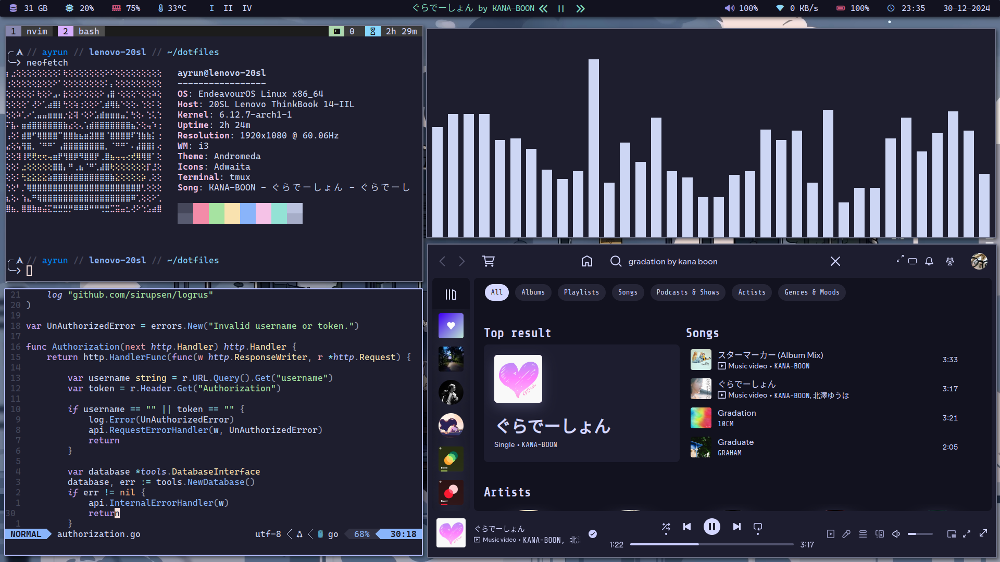
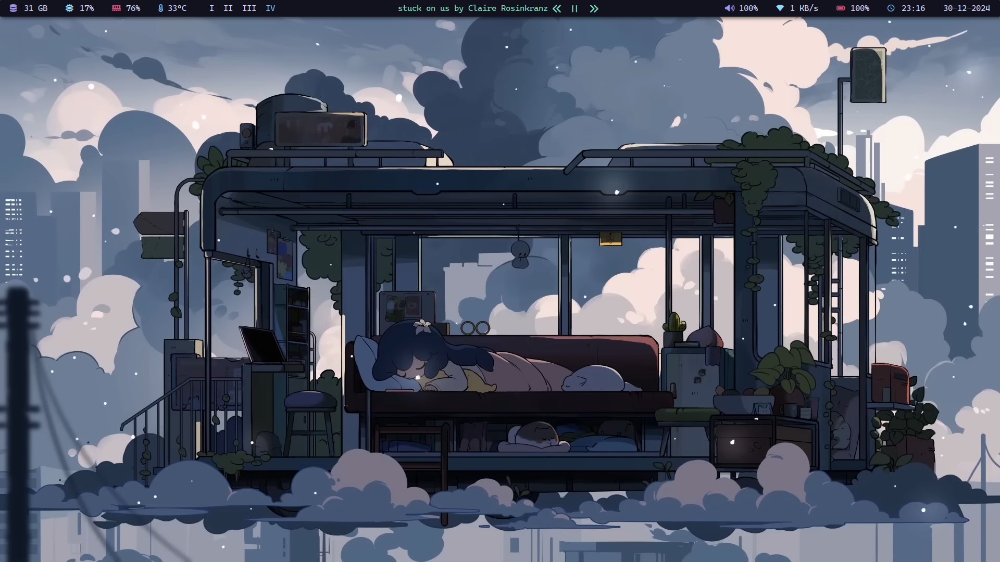

# My Personal Configuration for Linux

Welcome to my dotfiles repository! This repository contains my personal configuration files for the following tools and themes:

- **Alacritty** (Terminal Emulator)
- **Betterlockscreen** (Lockscreen Manager)
- **Dunst** (Notification Daemon)
- **i3** (Window Manager)
- **Neofetch** (System Info Tool)
- **Neovim (Nvim)** (Text Editor)
- **Picom** (Compositor)
- **Polybar** (Status Bar)
- **Rofi** (Application Launcher)
- **Starship** (Shell Prompt)
- **GTK Theme** (Andromeda Theme)
- **Tmux** (Terminal Multiplexer)

## Features

- Aesthetic and minimal configuration.
- Consistent theming across tools.
- Fully customizable and lightweight setup.
- Screenshot previews for inspiration.

## Gallery

---

---

---
