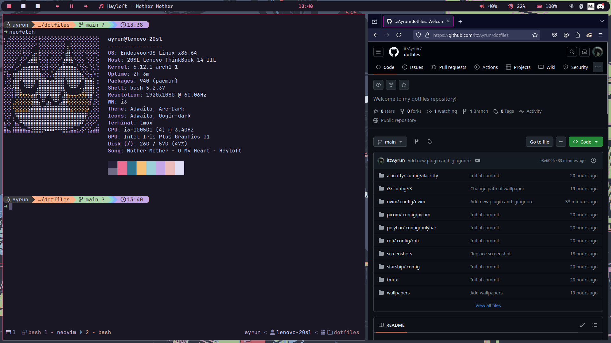
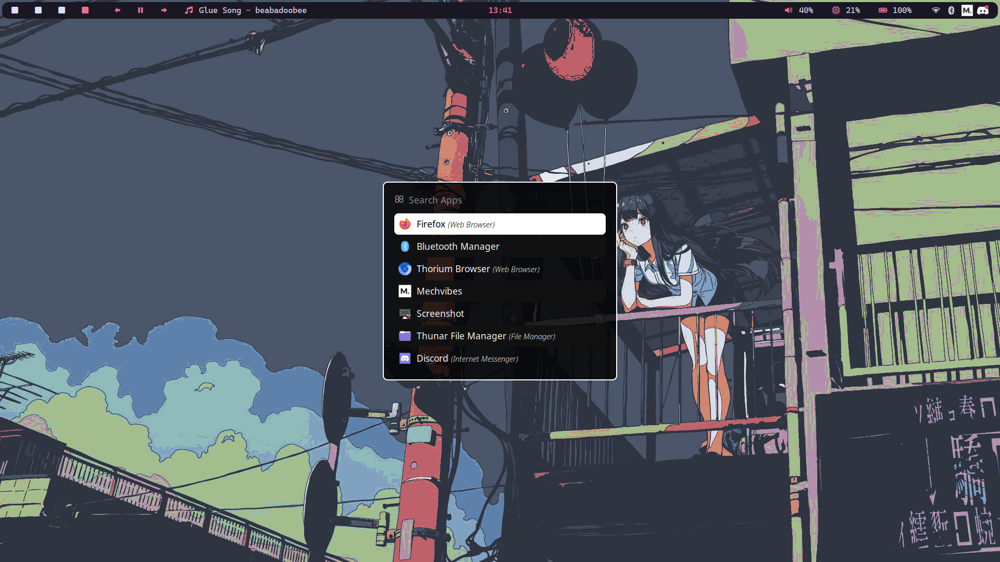

## Gallery

## Apps Customized

- Neovim
- i3wm
- Alacritty
- Polybar
- Starship
- Picom
- Rofi
- Tmux
- Neofetch (read credits for applying custom ASCII Art)

## Credits

I would like to acknowledge and thank the following repositories and creators whose dotfiles or configurations served as inspiration for this setup:

- [ScarletFiles](https://github.com/RezeScarlet/ScarletFiles)
- [typecraft-dev](https://github.com/typecraft-dev/dotfiles)

#### For Neofetch:

The process of applying the custom ASCII Art is shown very clearly in this repo: [uwu-neofetch-art](https://github.com/blyxyas/uwu-neofetch-art)
