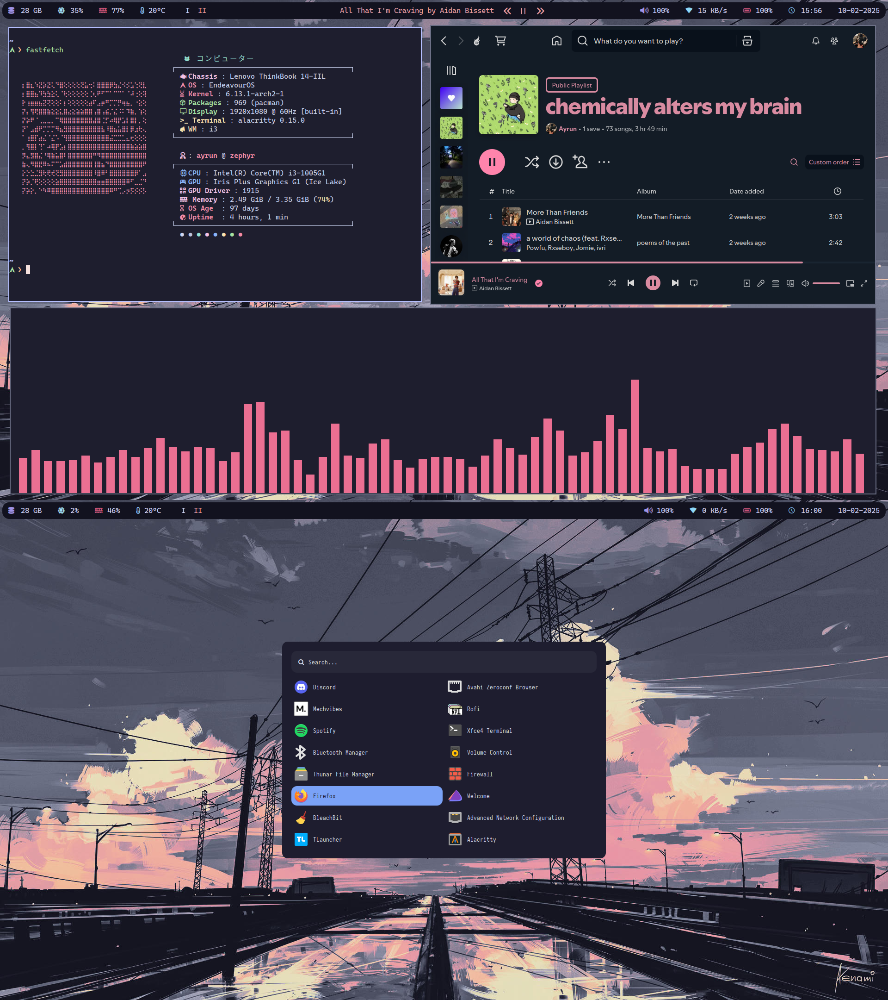

# My Personal Dotfiles

All of my configuration files in one place

This repository is made for my own personal needs, so it is only tested on EndeavourOS Linux.
Also note that the customization of all apps is in early state and may have several changes in the future.

## Apps Customized

- Alacritty
- BetterLockScreen
- Cava
- Dunst
- Fastfetch
- i3wm
- Neofetch
- Neovim
- Picom
- Polybar
- Starship
- Themes( for thunar file manager )
- Tmux
- Yazi
- Zsh

> [!NOTE]
> My personal wallpapers are included in the [wallpapers](./wallpapers/) folder.
